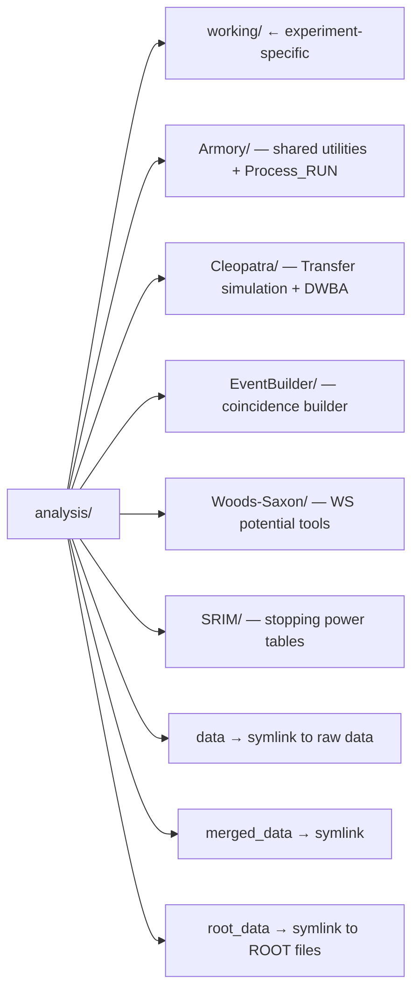
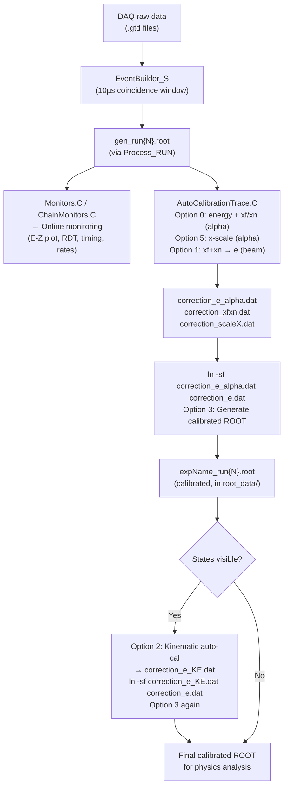

# analysis/working — Experiment Working Directory

This is the experiment-specific working directory. **All files here change per experiment branch.**
Shared/general code lives in `Armory/`, `Cleopatra/`, and `EventBuilder/`.

Last updated: March 2026, Ryan (goluckyryan@gmail.com)

---

## Files in This Directory

| File | Description |
|---|---|
| `GeneralSortMapping.h` | **Authoritative** detector channel mapping — digitizer → detector |
| `Analyzer.C/.h` | ROOT TSelector for event-by-event offline analysis |
| `Monitors.C/.h` | Online/offline monitor histograms (E-Z plot, RDT, timing, etc.) |
| `ChainMonitors.C` | TChain wrapper to run Monitors over multiple ROOT files |
| `AutoCalibrationTrace.C` | Calibration routine launcher (options 0–5) |
| `reactionConfig.txt` | Reaction kinematics: beam, target, recoil, energy, SRIM files |
| `detectorGeo.txt` | HELIOS spectrometer geometry: B-field, detector positions, bore, etc. |
| `Ex.txt` | Excitation energies + cross-sections for simulation |
| `DWBA/` | DWBA input/output files for Ptolemy calculation |
| `Simulation_Helper.C` | GUI interface for kinematics and DWBA simulation |
| `rootlogon.C` | ROOT startup macro — loads libraries, sets styles |
| `AutoFit_para.txt` | Parameters for AutoCalibration fitting |
| `Monitors.html` | Web display page for online Monitors canvas |

---

## Folder Structure (analysis/)

```
analysis/
├── working/          ← You are here (experiment-specific)
├── Armory/           — Shared utilities, calibration routines, Process_RUN
├── Cleopatra/        — Kinematic simulation (Transfer) + DWBA (Ptolemy wrapper)
├── EventBuilder/     — Coincidence event builder (replaces GEBSort/GEBMerge)
├── Woods-Saxon/      — Woods-Saxon potential tools
├── SRIM/             — SRIM stopping power tables
├── data →            — Symlink to raw data directory (experiment-specific)
├── merged_data →     — Symlink to merged data (Mac/analysis machines only)
└── root_data →       — Symlink to sorted ROOT files (Mac/analysis machines only)
```



**Note:** `data`, `merged_data`, and `root_data` are symbolic links created by `SetUpNewExp`.
On DAQ, only `data` symlink exists (raw data only, no subdirs).

---

## Data Flow



Output filename: `<expName>_<prefix>_run<first>-<last>.root` (e.g. `h094_19Ne_pp_run025-060.root`)

### Running Process_RUN
```bash
cd analysis/working
Process_RUN <RUNNUM> [build=1] [monitor=1]
# build=1   → run EventBuilder + sort
# monitor=1 → run ChainMonitors.C for online display
```

---

## Calibration Sequence

### Step 1 — Alpha source calibration
```bash
root -l AutoCalibrationTrace.C
# Option 0: Energy + xf/xn position calibration
# Option 5: X-scale calibration
# Option 1: xf+xn → energy calibration
ln -sf correction_e_alpha.dat correction_e.dat
# Option 3: Generate calibrated ROOT file
```

### Step 2 — Beam run verification
```bash
Process_RUN <beamRun> 1 1   # build + monitor
# Inspect E-Z plot in Monitors.C — check kinematic lines
```

### Step 3 — Kinematic refinement (optional, if states visible)
```bash
root -l AutoCalibrationTrace.C
# Option 2: Kinematic auto-calibration → correction_e_KE.dat
ln -sf correction_e_KE.dat correction_e.dat
# Option 3: Regenerate calibrated ROOT
```

### Key calibration files
| File | Description |
|---|---|
| `correction_e_alpha.dat` | Energy correction from alpha source calibration |
| `correction_e_KE.dat` | Energy correction from kinematic calibration |
| `correction_e.dat` | **Symlink** → either of the above (active calibration) |
| `correction_xfxn.dat` | Position (xf/xn) correction |
| `correction_scaleX.dat` | X-scale correction |

⚠️ `correction_e.dat` must always be a symlink — never edit directly.
⚠️ Det index 11 is always dead/disabled — hardcoded `scaleX=1.0` in calibration.

---

## Simulation

### Kinematic simulation (Transfer)
```bash
# Edit reactionConfig.txt, detectorGeo.txt, Ex.txt first
../Cleopatra/Transfer
# Output: transfer.root, reaction.dat
```

`transfer.root` contains:
- `tree` — simulated events (e, z, thetaCM, Ex, detID, loop)
- `fList` / `fxList` — E-Z kinematic lines (infinite / finite detector)
- `txList` — thetaCM vs Z curves
- `gList` — constant thetaCM lines

### DWBA calculation (Cleopatra/Ptolemy)
```bash
../Cleopatra/Cleopatra <input_file>
# Output: DWBA.root (cross-section distributions)
# Use DWBA.root as input to Transfer for weighted simulation
```

Or use the GUI:
```bash
root -l Simulation_Helper.C
```

---

## Initialization (new experiment)

1. Run `SetUpNewExp <expName>` — handles git branch + data dirs + symlinks
2. Edit `reactionConfig.txt` — set beam, target, recoil, energy
3. Edit `detectorGeo.txt` — set B-field, detector positions
4. Edit `GeneralSortMapping.h` — set channel mapping for this experiment
5. Check `Monitors.C` — adjust `skipDetID`, energy ranges, RDT cuts for this experiment

---

## Notes
- `GeneralSortMapping.h` is the **authoritative** detector map — EDM panels may be stale
- `working/` contents are experiment-specific — always verify after branch switch
- `Armory/`, `Cleopatra/`, `EventBuilder/` are shared — do not modify per-experiment
- In LCRC: use master branch only, set experiment via `expName.sh` + `MakeDataLinks`
